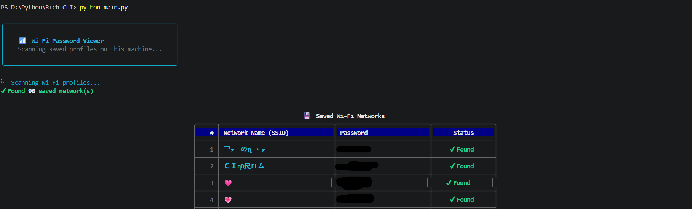

# 📶 WiFi Password Viewer (CLI) 🔐

A Python-based **Wi-Fi Password Viewer CLI Tool** that scans all saved Wi-Fi profiles on your Windows machine and displays their passwords in a **beautiful, styled terminal interface** powered by the `rich` library.

---

## 🧱 Project Structure

```bash
wifi-password-viewer-cli/
│
├── assets/             # Screenshots
├── main.py             # Main CLI application
├── requirements.txt
├── LICENSE
└── README.md           # Project documentation
```

---

## ✨ Features

### 📡 Auto Profile Scanner
- Automatically detects **all saved Wi-Fi profiles** on your Windows machine
- Uses Windows built-in `netsh` command — no third-party dependencies for data

### 🔐 Password Extractor
- Extracts passwords using `key=clear` flag via `netsh`
- Handles networks with **no password** and **encoding errors** gracefully

### 📊 Rich Terminal UI
- Animated **spinner** while scanning profiles
- **Progress bar** with live profile name updates while fetching passwords
- **Styled table** with status column: ✔ Found / No Password / ⚠ Error
- **Summary panel** at the end showing total, found, empty, and error counts
- **Footer rule** with a security reminder

### ⚡ Dual Mode Support
- 🧼 Basic CLI → Lightweight, no dependencies
- 🎨 Rich CLI → Enhanced UI with colors and panels

---

## 🛠 Technologies Used

| Technology | Role |
| --- | --- |
| **Python 3** | Core programming language |
| **subprocess** | Runs `netsh` commands to fetch Wi-Fi data |
| **rich** | Beautiful terminal UI (tables, panels, spinners, progress) |

---

## 📌 Requirements

```bash
Python 3.7+
Windows OS (uses netsh command)
```

Install required libraries:

```bash
pip install rich
```

---

## ▶️ How to Run

### 1️⃣ Clone the repository

```bash
git clone https://github.com/ShakalBhau0001/wifi-password-viewer-cli.git
```

### 2️⃣ Enter the project directory

```bash
cd wifi-password-viewer-cli
```

### 3️⃣ Install dependencies

```bash
pip install -r requirements.txt
```

OR

```bash
pip install rich
```

### 4️⃣ Run the tool

```bash
python main.py
```

> ⚠️ **Run as Administrator** for full password access.

---

## 🖥️ Usage

After running, you will see a scan spinner, then a styled table like this:

```
╭────────────────────────────────────────────────────────────────╮
│                    💾  Saved Wi-Fi Networks                    │
├────┬──────────────────────────┬─────────────────┬─────────────┤
│  # │ Network Name (SSID)      │ Password        │   Status    │
├────┼──────────────────────────┼─────────────────┼─────────────┤
│  1 │ HomeNetwork              │ mypassword123   │ ✔ Found     │
│  2 │ OfficeWifi               │ ── No password ─│ No Password │
│  3 │ Cafe_Free                │ cafepass@2024   │ ✔ Found     │
╰────┴──────────────────────────┴─────────────────┴─────────────╯
```

### Summary Panel

```
Total: 3   ✔ Found: 2   No Password: 1   ⚠ Errors: 0
```

---

## ⚙️ How It Works

### 1️⃣ Profile Scanning
- Runs `netsh wlan show profiles` to get all saved Wi-Fi profile names
- Displays a live **spinner** during this step

### 2️⃣ Password Fetching
- For each profile, runs `netsh wlan show profile <name> key=clear`
- Parses the `Key Content` field to extract the password
- A **progress bar** updates in real time showing which profile is being fetched

### 3️⃣ Table Display
- Results are displayed in a **Rich styled table** with color-coded status
- A **summary panel** shows the final count of found, empty, and errored profiles

---

## ⚠️ Limitations

- **Windows only** — uses `netsh`, which is a Windows-exclusive command
- Requires **Administrator privileges** to read saved passwords
- Only shows passwords for networks saved on the current machine

---

## 🌟 Future Enhancements

- Export results to `.txt` or `.csv` file
- Copy password to clipboard with a keypress
- Search/filter networks by name
- Linux & macOS support via `nmcli` and `security` commands
- GUI version using `tkinter` or `PyQt`

---

## ⚠️ Disclaimer

> **Please read carefully before use.**

- This tool is intended for **personal and educational use only**
- Only displays passwords for **Wi-Fi networks saved on your own machine**
- **Do NOT use this tool on machines you do not own or have permission to access**
- The developer takes **no responsibility** for any misuse of this tool

---

## 📸 Preview




---

## 🪪 Author

> **Creator: Shakal Bhau**

> **GitHub: [ShakalBhau0001](https://github.com/ShakalBhau0001)**

---

## ⭐ Support

If you like this project, consider giving it a ⭐ on GitHub!

---
